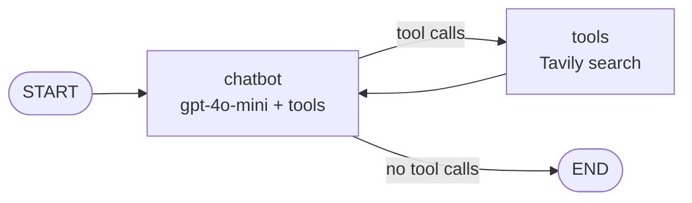
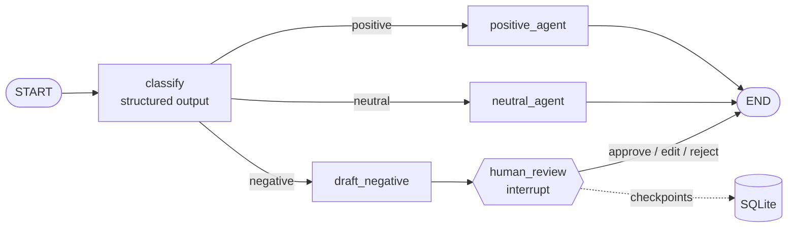

# LangGraph Agent: Tools, Memory, Structured Routing and Human-in-the-Loop

[](https://colab.research.google.com/github/Ruturaj2472/LangGraph_Agent/blob/main/LangGraph_Agent.ipynb)


A step-by-step LangGraph project that builds from a single LLM call to a customer-feedback agent with **tool calling**, **per-user memory**, **structured-output routing**, **human approval of risky replies**, **durable SQLite checkpointing**, and a **labeled evaluation** of routing accuracy.

Each stage adds one capability on top of the previous one, and every stage is run end to end in the notebook with its outputs saved.

---

## Contents

- [Highlights](#highlights)
- [Stages](#stages)
- [Architecture](#architecture)
- [Results](#results)
- [Tech Stack](#tech-stack)
- [Project Structure](#project-structure)
- [Getting Started](#getting-started)
- [Design Decisions](#design-decisions)
- [Limitations and Next Steps](#limitations-and-next-steps)

---

## Highlights

- **Agent decides when to use tools.** A general-knowledge question is answered directly; a current-events question triggers a Tavily web search, and the agent loops back to answer from the results.
- **Reliable routing with structured output.** The sentiment classifier is constrained by a Pydantic schema to exactly `positive`, `negative`, or `neutral`, so free-text answers can never break the graph.
- **Human-in-the-loop for risky replies.** Replies to negative feedback pause with `interrupt()` until a reviewer approves, edits, or rejects them.
- **Durable state.** Paused reviews are stored in SQLite with `SqliteSaver` and survive a restart.
- **Measured, not assumed.** Routing accuracy is evaluated on 30 hand-labeled examples, including sarcasm and understatement: **100% (30/30)**.

---

## Stages

| # | Stage | What it adds | Key LangGraph features |
|---|---|---|---|
| 1 | Single LLM agent | One node that calls the LLM | `StateGraph`, `add_messages` reducer, `START`/`END` |
| 2 | Tool-using agent | Tavily web search with an LLM → tool → LLM cycle | `bind_tools`, `ToolNode`, `tools_condition` |
| 3 | Agent with memory | Conversation memory isolated per user thread | `MemorySaver`, `thread_id`, `get_state` |
| 4 | Sentiment router | Classifies feedback and routes it to one of three response agents | Conditional edges, `with_structured_output` |
| 5 | Human-in-the-loop review | Pauses negative-feedback replies for approval; durable storage | `interrupt`, `Command(resume=...)`, `SqliteSaver` |
| 6 | Evaluation | Routing accuracy, per-class accuracy, confusion matrix | 30-example labeled set |

### Stage 2: Tool use

The LLM is bound to the Tavily search tool. After each LLM step, `tools_condition` checks for tool calls: if there are any, `ToolNode` runs them and the results go back to the LLM; otherwise the graph ends. A `run_agent()` helper prints every step and reports whether Tavily was called.

### Stage 3: Memory

The tool agent is compiled with a `MemorySaver` checkpointer. Within thread `User_1` the agent remembers the user's name across turns; a new thread `User_2` has no access to it.

### Stage 4: Structured sentiment routing

A classifier LLM returns a `SentimentResult` Pydantic object whose `sentiment` field is a `Literal["positive", "negative", "neutral"]`. A conditional edge maps each label to a dedicated response agent:

- `positive_agent` thanks the customer
- `negative_agent` apologizes and commits to addressing the issue
- `neutral_agent` handles questions and factual messages

### Stage 5: Human-in-the-loop with durable memory

Positive and neutral replies are sent automatically. Negative feedback goes to `draft_negative`, then to `human_review`, which calls `interrupt()` and pauses the graph with the draft. The reviewer resumes the graph with one of three decisions:

| Decision | Resume command | Result |
|---|---|---|
| Approve | `Command(resume={"action": "approve"})` | Draft is sent as written |
| Edit | `Command(resume={"action": "edit", "reply": "..."})` | Reviewer's reply is sent instead |
| Reject | `Command(resume={"action": "reject"})` | Nothing is sent; ticket is escalated |

All checkpoints are written to `feedback_checkpoints.db`. The notebook closes the database connection, rebuilds the graph from scratch, and shows that the paused review and its draft are restored.

### Stage 6: Evaluation

30 hand-labeled examples (10 per class) are run through the classifier. Because each label maps to exactly one node, classifier accuracy equals routing accuracy. The set includes harder cases such as sarcasm ("Oh great, another hour on hold. Fantastic service as always.") and understatement ("Not bad at all, actually one of the better experiences I've had.").

---

## Architecture

### Tool-using agent (Stages 2–3)



### Feedback agent with human review (Stage 5)



---

## Results

All results below come from the saved notebook outputs.

### Tool use

| Question | Tavily called | Behavior |
|---|---|---|
| "What do you know about AI?" | No | Answered from model knowledge |
| "What are the top AI news headlines this week?" | Yes | Searched with `topic: news`, `time_range: week`, then answered from results |

### Sentiment routing

| Feedback | Route |
|---|---|
| "I absolutely loved the service! The staff were friendly..." | `positive_agent` |
| "The service was slow, and the staff seemed disinterested..." | `negative_agent` |
| "My experience was frustrating. The website was hard to navigate..." | `negative_agent` |
| "Do you offer delivery on Sundays?" | `neutral_agent` |

### Human-in-the-loop

| Ticket | Feedback | Outcome |
|---|---|---|
| `ticket_101` | Order arrived broken, emails unanswered | Paused → survived restart → **approved** |
| `ticket_102` | Charged twice, no refund | Paused → **edited by reviewer** |
| `ticket_103` | Support fixed issue in minutes | No pause → **auto-sent** |

### Routing evaluation

**Accuracy: 100% (30/30)**

| Expected \ Predicted | negative | neutral | positive |
|---|---|---|---|
| **negative** | 10 | 0 | 0 |
| **neutral** | 0 | 10 | 0 |
| **positive** | 0 | 0 | 10 |

The set is small and mostly unambiguous, so this shows the structured-output router is reliable on clear cases, including sarcasm. It is not a claim of perfect accuracy on real-world feedback (see [Limitations](#limitations-and-next-steps)).

---

## Tech Stack

| Component | Purpose |
|---|---|
| **LangGraph** | Graph orchestration, conditional routing, checkpointing, interrupts |
| **LangChain Core / langchain-openai** | Prompts, structured output, OpenAI chat models |
| **OpenAI gpt-4o-mini** | Chat, tool calling, classification, reply drafting |
| **langchain-tavily** | Web search tool for current information |
| **Pydantic** | Schema that constrains classifier output |
| **langgraph-checkpoint-sqlite** | Durable checkpoints for human-in-the-loop review |
| **pandas** | Evaluation metrics and confusion matrix |
| **Google Colab** | Notebook runtime and secret management |

---

## Project Structure

```
LangGraph_Agent/
├── LangGraph_Agent.ipynb   # All six stages, with saved outputs
├── README.md
├── requirements.txt
└── .gitignore
```

---

## Getting Started

### API keys

| Service | Variable | Get one at |
|---|---|---|
| OpenAI | `OPENAI_API_KEY` | https://platform.openai.com/api-keys |
| Tavily | `TAVILY_API_KEY` | https://tavily.com |

### Option 1: Google Colab (recommended)

1. Click the **Open in Colab** badge at the top of this page.
2. Open the **Secrets** panel (key icon in the left sidebar), add `OPENAI_API_KEY` and `TAVILY_API_KEY`, and enable notebook access for both.
3. If Stage 5 raises `ModuleNotFoundError: langgraph.checkpoint.sqlite`, run `!pip install -q langgraph-checkpoint-sqlite` in a new cell.
4. Run **Runtime → Run all**.

### Option 2: Run locally

```bash
git clone https://github.com/Ruturaj2472/LangGraph_Agent.git
cd LangGraph_Agent
python -m venv venv
source venv/bin/activate        # Windows: venv\Scripts\activate
pip install -r requirements.txt

export OPENAI_API_KEY="sk-..."
export TAVILY_API_KEY="tvly-..."
jupyter notebook LangGraph_Agent.ipynb
```

The notebook loads keys with Colab's `userdata`, which does not exist locally. Replace the two key-loading cells with:

```python
import os
assert os.getenv("OPENAI_API_KEY") and os.getenv("TAVILY_API_KEY"), "Set both API keys first"
```

Never commit API keys. `.env` files and the SQLite checkpoint database are excluded in `.gitignore`.

---

## Design Decisions

**Structured output instead of parsing text.** An earlier version of the router parsed the classifier's free-text answer, so a reply like `"Positive."` failed to match any route. Constraining the output with a Pydantic `Literal` makes invalid routes impossible rather than handled.

**Human review only where the risk is.** Apologies to unhappy customers carry the most risk (wrong promises, wrong tone), so only that path pauses. Positive and neutral replies are low-risk and sent automatically, which keeps reviewer workload small.

**Durable checkpoints for paused work.** A review can wait hours for a human. With in-memory state, a restart would lose it; `SqliteSaver` keeps it on disk, which the notebook demonstrates with a simulated restart.

**Temperature 0 for classification.** The classifier and tool agent use `temperature=0` for consistent, repeatable decisions. The reply writer uses `temperature=0.3` for slightly more natural wording.

**One LLM instance per role.** Models are created once with explicit names rather than inside every node, which avoids repeated setup and makes the model choice visible.

---

## Limitations and Next Steps

| Limitation | Possible next step |
|---|---|
| Draft replies sometimes include placeholders such as `[Customer's Name]` (visible in the saved outputs) | Tighten the reply prompt; this is also the kind of issue human review catches before sending |
| Evaluation set is small (30) and mostly unambiguous | Add mixed-sentiment feedback (e.g. "great food, terrible wait") and real customer data |
| Stages 1–3 use in-memory `MemorySaver` | Use `SqliteSaver` or `PostgresSaver` for all stages |
| Conversation history grows without limit within a thread | Trim or summarize history with `trim_messages` |
| No retry or error handling around LLM and tool calls | Add `.with_retry()` and a `recursion_limit` |
| Notebook only; API keys loaded through Colab | Package as a FastAPI service with a review UI and environment-based config |

---

## Author

**Ruturaj Pangavhane**: [GitHub](https://github.com/Ruturaj2472)
